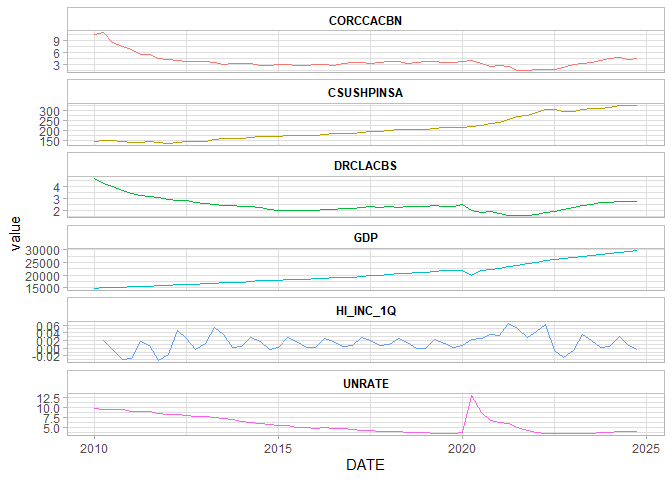
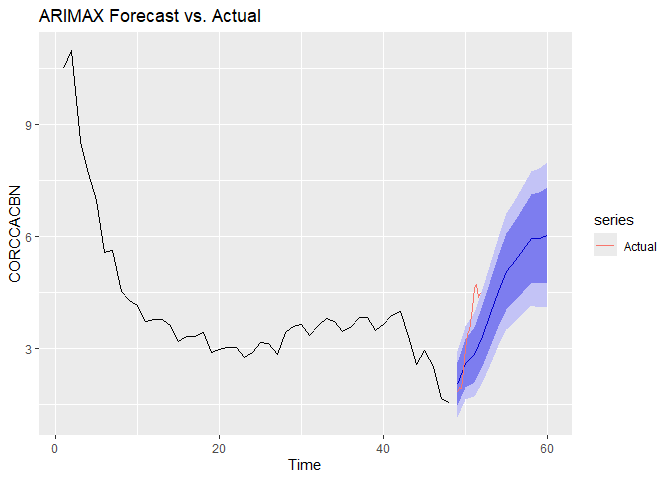
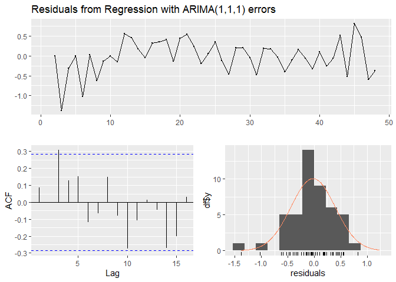

# Financial & Risk Analytics Expertise – CECL, Credit Risk, and Predictive Modeling
Maryam Shahbaz Ali

##  Overview
This project implements a Current Expected Credit Loss (CECL) framework to estimate lifetime expected credit losses for a loan portfolio. Using real-world economic indicators such as GDP, unemployment rate, home price index, and delinquency rates, it builds statistical and time-series models to predict the Probability of Default (PD) and portfolio-level loss estimates under CECL guidelines. The workflow covers data cleaning, frequency alignment, feature engineering, and ARIMAX modeling to forecast losses under baseline and adverse macroeconomic scenarios. The project also includes visual analytics, backtesting, and model simplification to balance accuracy and interpretability, aligning with regulatory expectations for CECL compliance and stress testing.


## Objectives
- Predict Probability of Default (PD) for financial assets.
- Estimate lifetime expected credit losses in compliance with CECL standards.
- Perform scenario analysis and stress testing using macroeconomic factors.

## Tools & Libraries
- Language: R
- Packages: `tidyverse`, `dplyr`, `ggplot2`, `glmnet`, `caret`

## Project Workflow
1. Data Preprocessing
   - Handle missing values and outliers
   - Create derived variables (loan age, delinquency status)
2. Feature Engineering
   - Incorporate macroeconomic indicators (GDP, unemployment rates)
3. Model Development
   - Logistic Regression / GLM models for PD estimation
   - Regularization using `glmnet`
4. Scenario Analysis
   - Stress testing under baseline and adverse conditions
5. Validation
   - Backtesting model predictions vs. actual losses

##  Results
- Built CECL-compliant model for expected credit loss estimation
- Visualized portfolio-level lifetime losses under multiple economic scenarios


# Libraries and Tools
## Loads key R packages (dplyr, readxl, lubridate, forecast, tidyr, ggplot2) for data manipulation, time series modeling, and visualization.
``` r
library(dplyr)
```


    Attaching package: 'dplyr'

    The following objects are masked from 'package:stats':

        filter, lag

    The following objects are masked from 'package:base':

        intersect, setdiff, setequal, union

``` r
library(readxl)
library(lubridate)
```


    Attaching package: 'lubridate'

    The following objects are masked from 'package:base':

        date, intersect, setdiff, union

``` r
library(forecast)
```

    Warning: package 'forecast' was built under R version 4.5.1

    Registered S3 method overwritten by 'quantmod':
      method            from
      as.zoo.data.frame zoo 

``` r
library(tidyr)
```

    Warning: package 'tidyr' was built under R version 4.5.1

``` r
library(ggplot2)
```

# Data Import
## Reads in loan performance and macroeconomic datasets (credit balances, home price index, charge-offs, GDP, unemployment) from Excel files.
``` r
corccacbn <- read_xlsx('Data/CORCCACBN.xlsx', sheet = "Quarterly")
csushpinsa <- read_xlsx('Data/CSUSHPINSA.xlsx', sheet = "Monthly")
drclacbs <- read_xlsx('Data/DRCLACBS.xlsx', sheet = "Quarterly, End of Period")
gdp <- read_xlsx('Data/GDP.xlsx', sheet = "Quarterly")
unrate <- read_xlsx('Data/UNRATE.xlsx', sheet = "Monthly")
```

# Data Standardization and  Date Formatting
## Renames and converts all date columns to a standard format (as.Date), preparing data for alignment and merging.

``` r
corccacbn <- corccacbn %>% rename(DATE = 1) %>% mutate(DATE = as.Date(DATE))
csushpinsa <- csushpinsa %>% rename(DATE = 1) %>% mutate(DATE = as.Date(DATE))
drclacbs <- drclacbs %>% rename(DATE = 1) %>% mutate(DATE = as.Date(DATE))
gdp <- gdp %>% rename(DATE = 1) %>% mutate(DATE = as.Date(DATE))
unrate <- unrate %>% rename(DATE = 1) %>% mutate(DATE = as.Date(DATE))
```

# Frequency Conversion
## Converts monthly macroeconomic data to quarterly using floor_date() and aggregates by quarter for consistency in time series analysis.

``` r
# Convert to quarter start for alignment
csushpinsa_q <- csushpinsa %>%
  mutate(DATE = floor_date(DATE, "quarter")) %>%
  group_by(DATE) %>%
  summarize(across(everything(), mean), .groups = "drop")

unrate_q <- unrate %>%
  mutate(DATE = floor_date(DATE, "quarter")) %>%
  group_by(DATE) %>%
  summarize(across(everything(), mean), .groups = "drop")
```

# Data Merging
## Joins loan and macroeconomic datasets on the DATE field to create a unified modeling dataset.

``` r
df <- corccacbn %>%
  left_join(csushpinsa_q, by = "DATE") %>%
  left_join(drclacbs, by = "DATE") %>%
  left_join(gdp, by = "DATE") %>%
  left_join(unrate_q, by = "DATE")
```
# Feature Engineering
## Creates derived variable HI_INC_1Q capturing quarterly home price index change to enhance model predictive power.
``` r
df <- df %>%
  mutate(HI_INC_1Q= CSUSHPINSA/lag(CSUSHPINSA, n=1)-1)
```

#  Data Visualization – Trends
##  Data Visualization – Trends

``` r
df_long <- df %>%
  pivot_longer(cols= -DATE, names_to = "variable", values_to= "value")
Trend_plot <- df_long %>% 
  ggplot() + 
  geom_line(aes(x=DATE, y=value, color = variable)) +
  facet_wrap(.~variable, ncol =1, scales = "free_y") +
  theme_light() +
  theme(
    strip.background = element_rect(fill = "white", color = "grey"),
    strip.text = element_text(color = "black", face = "bold"), 
    legend.position = "none"
  )
Trend_plot
```

    Warning: Removed 1 row containing missing values or values outside the scale range
    (`geom_line()`).



``` r
ggsave("trend.pdf",Trend_plot, height = 7, width= 6)
```

    Warning: Removed 1 row containing missing values or values outside the scale range
    (`geom_line()`).

# ARIMAX Model- Full Feature Set
## Fits an ARIMAX model using macroeconomic regressors (HI_INC_1Q, DRCLACBS, GDP, UNRATE) to model credit card balances (CORCCACBN).

``` r
X <- df%>%
  select(HI_INC_1Q,DRCLACBS,GDP,UNRATE ) %>%
  as.matrix()
Model_ARIMAX <- Arima(df$CORCCACBN,order= c(1,1,1), xreg = X)

summary(Model_ARIMAX)
```

    Series: df$CORCCACBN 
    Regression with ARIMA(1,1,1) errors 

    Coefficients:
              ar1      ma1  HI_INC_1Q  DRCLACBS    GDP  UNRATE
          -0.2074  -0.2272     2.7435    2.9165  0e+00  0.1437
    s.e.   0.2430   0.2125     2.2925    0.3343  3e-04  0.0649

    sigma^2 = 0.172:  log likelihood = -28.18
    AIC=70.36   AICc=72.6   BIC=84.78

    Training set error measures:
                          ME      RMSE       MAE        MPE     MAPE      MASE
    Training set -0.01602937 0.3893432 0.2868432 -0.2962318 8.379089 0.8336823
                       ACF1
    Training set 0.08285462

#  Model Simplification- Simplifying the model by removing GDP, National Home Price index
## Removes less significant predictors (GDP, CSUSHPINSA) to compare performance and parsimony against the full model.
``` r
X2 <- df%>%
  select(DRCLACBS,UNRATE) %>%
  as.matrix()
Model_ARIMAX2 <- Arima(df$CORCCACBN,order= c(1,1,1), xreg = X2)

summary(Model_ARIMAX2)
```

    Series: df$CORCCACBN 
    Regression with ARIMA(1,1,1) errors 

    Coefficients:
              ar1      ma1  DRCLACBS  UNRATE
          -0.3580  -0.2129    2.6561  0.1512
    s.e.   0.2272   0.1986    0.2940  0.0395

    sigma^2 = 0.1833:  log likelihood = -31.76
    AIC=73.51   AICc=74.65   BIC=83.9

    Training set error measures:
                           ME      RMSE       MAE        MPE     MAPE      MASE
    Training set -0.003983388 0.4098826 0.3143303 -0.6232095 8.813286 0.9135707
                       ACF1
    Training set 0.06134288

# Train-Test Split
## Splits data 80/20 into training and testing sets for model evaluation

``` r
Train-Test Split
n <- nrow(df)
split_index <- floor(0.8 * n)

# Define training and test sets
train_y <- df$CORCCACBN[1:split_index]
test_y  <- df$CORCCACBN[(split_index + 1):n]

train_x <- X[1:split_index, ]
test_x  <- X[(split_index + 1):n, ]
```

# Fit ARIMAX model on training data
model_arimax <- Arima(train_y, order = c(1,1,1), xreg = train_x)

# Forecasting & Evaluation
## Uses ARIMAX to forecast test data, plots predicted vs. actual values, and calculates accuracy metrics (RMSE, MAPE, MAE).
forecast_arimax <- forecast(model_arimax, xreg = test_x, h = length(test_y))

# Convert test_y to ts object for plotting
test_y_ts <- ts(test_y, start = end(time(train_y))[1] + 1, frequency = 4)  # Assuming quarterly

# Plot forecasts vs. actuals
autoplot(forecast_arimax) +
  autolayer(test_y_ts, series = "Actual") +
  ggtitle("ARIMAX Forecast vs. Actual") +
  xlab("Time") + ylab("CORCCACBN")
```



#  Accuracy metrics
``` r
accuracy(forecast_arimax, test_y)
```

                          ME      RMSE       MAE         MPE      MAPE      MASE
    Training set -0.02407529 0.4138663 0.3111492  -0.3258051  9.153761 0.8804342
    Test set     -1.08533447 1.1528468 1.0853345 -32.5214945 32.521494 3.0710849
                       ACF1
    Training set 0.08748796
    Test set             NA

# Residual Diagnostics
## Performs residual analysis and Ljung-Box test to check model adequacy and autocorrelation in residuals.

``` r
checkresiduals(model_arimax)
```




        Ljung-Box test

    data:  Residuals from Regression with ARIMA(1,1,1) errors
    Q* = 14.836, df = 8, p-value = 0.06242

    Model df: 2.   Total lags used: 10
